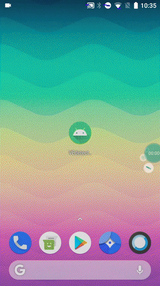
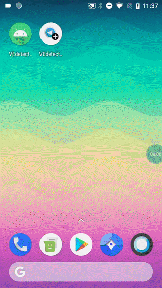
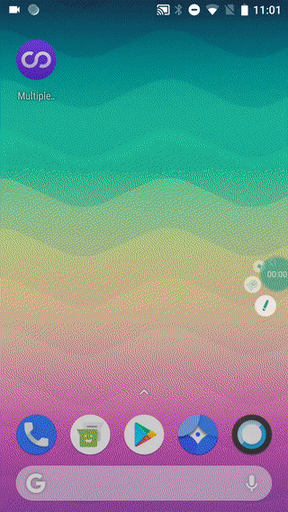
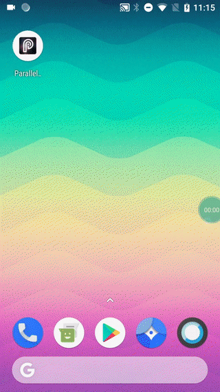
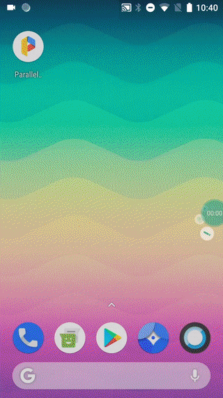
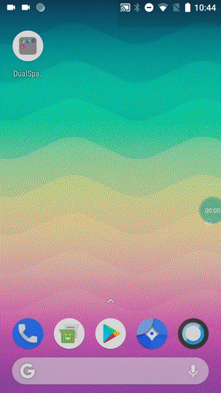
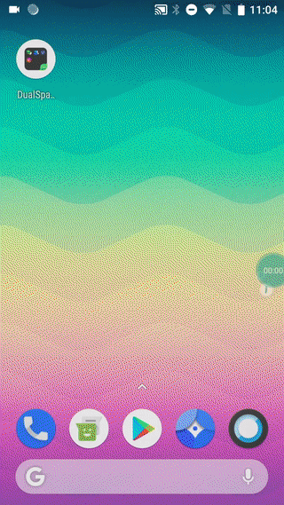
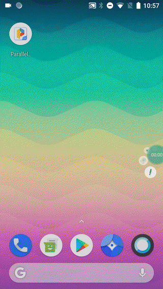
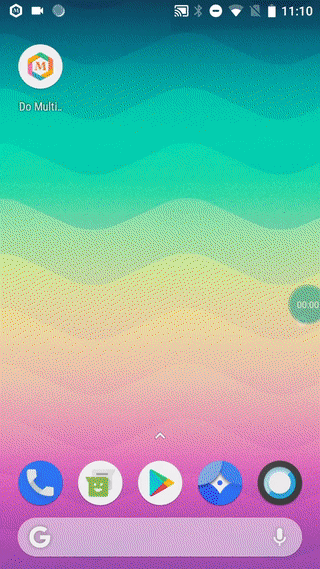
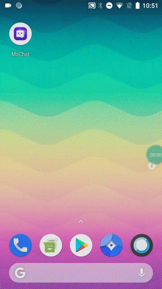

## Configuration

Starting from each __victim_app.apk__ file this framework will create two malicious files:
*    __malicious_addon.apk__ 
*    __malicious.apk__

To generate them, run the following command:

```
python3 customize.py <directory_apk_victim_app> <directory_malicious_addon_icons> <directory_output> <package_name_malicious_addon> <IP_address>
```

*    __<directory_apk_victim_app>__: contains the apk files of the victim apps

*   __<directory_malicious_addon_icons>__: contains the icons that will be associated to the malicious add-ons. PNG format is required for the icons

*   __<directory_output>__: any directory to redirect the output

*   __<package_name_malicious_addon>__: package of the malicious add-ons, you can pick any

*   __<IP_address>__: the IP address of your PC


## Usage

To launch the attack you need to:

1) Connect the computer and the smartphone to the same network

2) Install the victim app on the smartphone 
```
adb install -g victim_app.apk
```

3) Install the malicious add-on on the smartphone
```
adb install -g maliciousaddon.apk
```

4) Create a directory for the server and save there the malicious.apk and the server file index.php

5) From the directory of the server, open a terminal and launch the server with 
```
sudo php -S 0.0.0.0:80
```

6) On the smartphone, launch the malicious add-on (the malicious.apk should be downloaded from the server)

7) On the smartphone, go to your Home page and launch the icon of the victim app

## Attack Demo

### Demo of the attack against Alamo App:


<br/>

### Demo of the attack against Telegram App:


<br/>

### Demo of the attack against Amazon Music App:


## Anti-Virtualization Mechanisms

Below, we illustrate all the mechanisms used for the detection of the virtualized environments and how *Màscara* can bypass them.

The analyzed anti-virtualization techniques come from the following four papers: 
L. Shi, J. Fu, Z. Guo, and J. Ming. 2019. "Jekyll and Hyde" is Risky: Shared-Everything Threat Mitigation in Dual-Instance Apps. In Proceedings of the 17th Annual International Conference on Mobile Systems, Applications, and Services (MobiSys '19).
L. Zhang, Z. Yang, Y. He, M. Li, S. Yang, M. Yang, Y. Zhang, and Z. Qian. 2019. App in the Middle: Demystify Application Virtualization in Android and its Security Threats. In Abstracts of the 2019 SIGMETRICS/Performance Joint International Conference on Measurement and Modeling of Computer Systems (SIGMETRICS '19).
Dai, D., Li, R., Tang, J., Davanian, A., & Yin, H. (2020, June). Parallel Space Traveling: A Security Analysis of App-Level Virtualization in Android. In Proceedings of the 25th ACM Symposium on Access Control Models and Technologies (pp. 25-32).
T. Luo, C. Zheng, Z. Xu,  and X. Ouyang. (2017). Anti-Plugin: Don't let your app play as an Android plugin. Proceedings of Blackhat Asia.


#####  Detection mechanism 1:
In a virtualized environment, all the applications share the same permissions, since they share also the same UID. In *Màscara*, the malicious add-on declares the same permissions of the victim app.

#####  Detection mechanism 2:
In a virtualized environment, an application can check the permissions associated with its own package name through the *PackageInfo* object. If the application is not installed, an error is triggered. In *Màscara*, the application is already installed.

#####  Detection mechanism 3:
In a virtualized environment, an application can check the undeclared permissions through the *checkCallingOrSelfPermission* API. In *Màscara*, the malicious add-on declares the same permissions of the victim app.

#####  Detection mechanism 4:
Through the API of the *PackageManager*, it is possible to return the list of all the applications installed on a device and trigger an error if the application is not installed. In *Màscara*, the application is already installed.

#####  Detection mechanism 5:
Through the APIs *getRecentTasks(int,int)* and *getRunningTasks(int)* it is possible to see the list of all running tasks (a task is a collection of activities). From Android level 21 those APIs are restricted to return only the caller's own tasks. Moreover, the malicious app run in the virtual environment has only services and no activities.

#####  Detection mechanism 6:
Through the API *getRunningServices(int)* it is possible to return the list of running services. In *Màscara*, this method is hooked using *Whale* and the return value reveals only the services of the plugin app and not of the malicious one. 

#####  Detection mechanism 7:
The API *getRunningAppProcess(int)* returns the list of processes running on a device. By running this method in a virtualized environment, it is possible to see two processes: the container application and the virtualized one. In *Màscara* the two processes share the same UID. However, though the *Dynamic Proxy API module* of DroidPlugin the method is hooked and the the return value hides all the suspicious process names.

#####  Detection mechanism 8:
In a virtualized environment an application can check the list of processes though the method *Runtime.exec(String)* and the command *ps*. In *Màscara*, this method is hooked using *Whale* so that it returns always the result of the *ps* command.

#####  Detection mechanism 9:
Through the API *getApplicationInfo* an application can check whether its private directory follows the default Android pattern. In *Màscara* this method is hooked though the *Dynamic Proxy API module* of DroidPlugin so that the return value always matches the default Android directory pattern.

#####  Detection mechanism 10:
Through the object *ApplicationInfo* an application can check the location of its APK by inspecting the field *sourceDir*. Since the Android framework returns this object for a given package name, in *Màscara* the package name is associated to the victim app one. 

#####  Detection mechanism 11:
In a virtualized environment the process memory contains also the malicious add-on path. In *Màscara* any access to  *”/proc/self/maps”* is disabled by hooking the constructor of the class *File* though *Whale*.

#####  Detection mechanism 12:
In a virtualized environment the process memory contains also the dynamic-link library path. In *Màscara* any access to  *”/proc/self/maps”* is disabled by hooking the constructor of the class *File* though *Whale*.

#####  Detection mechanism 13:
Though the method *getDataDir()* it is possible to know the current data directory. In *Màscara* this method is hooked through *Whale* so that the VBA data directory is replaced with a native fake one.

#####  Detection mechanism 14:
Usually, *DroidPlugin* declares only one stub service. In a virtualized environment an application can launch a higher number of services to trigger an exception. In *Màscara* all the components of a victim app are declared in the malicious add-on manifest file.

#####  Detection mechanism 15:
Though the API *PackageInfo* an application can retrieve all the information about its components. In *Màscara* the application will retrieve the object associated with the real application installed on the device.

#####  Detection mechanism 16:
In a virtualized environment an application can try to unregister all the dynamically registered receivers and send them an event to confirm that the process was successful. In *Màscara*, all victim app components are copied in the malicious add-on, including Broadcast Receivers.

#####  Detection mechanism 17:
The API *setComponentEnabledSetting(ComponentName,int,int)* can change the properties of a component at runtime. In a virtualized environment the components have different names. In *Màscara* the API *setComponentEnabledSetting* is hooked changing at runtime the real *componentName* with the fake one.

#####  Detection mechanism 18:
In a virtualized environment all the applications share the same native components, such a *WebView*. Therefore, an application can check the presence of one of these components. However, in *Màscara* there is no native component.

#####  Detection mechanism 19:
An application can analyze the stack trace of the lifecycle functions, which should be different in a virtualized environment. In *Màscara* all the methods that return the stack trace are hooked through *Whale* to return the native stack trace.


## Anti-Virtualization Demo

All the virtualization detection mechanisms have been embedded in a custom app called VEdetection.
Below, we show the effectiveness of the existing anti-virtualization mechanisms when applied against the most popular virtualization-based apps on the Play Store and against *Màscara*.

Virtualization detection against native environment:


Virtualization detection against Màscara:


Virtualization detection against com.exelliance.multiaccounts:


Virtualization detection against com.in.parallel.accounts:


Virtualization detection against com.lbe.parallel.intl:


Virtualization detection against com.ludashi.dualspace:


Virtualization detection against com.ludashi.superboost:


Virtualization detection against com.parallel.space.lite:


Virtualization detection against com.polestar.domultiple:


Virtualization detection against info.cloneapp.mochat.in.goast:



